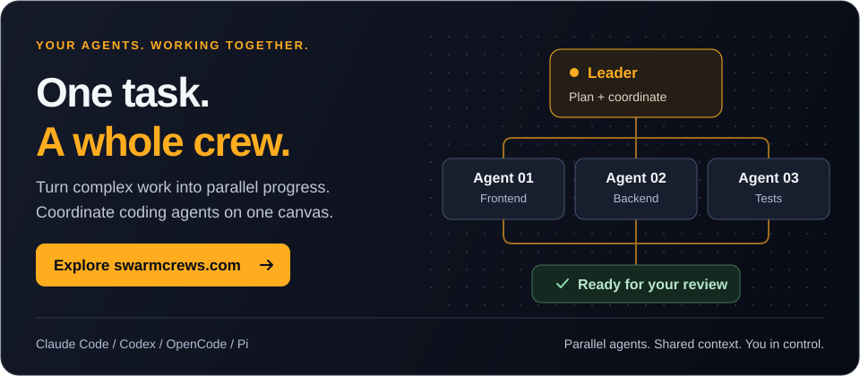

<p align="center">
  
</p>

<p align="center">
A spatial workspace for coordinating coding agents through Claude Code,
OpenAI Codex, GitHub Copilot, OpenCode, and Pi harnesses. Give a Leader a complex task; it
can delegate bounded tasks to Minion agents and coordinate their progress.
</p>

<p align="center">
  <a href="https://swarmcrews.com">
    
  </a>
</p>

> **Status:** Early-stage open-source software. Interfaces and data formats may
> change, and rough edges should be expected.

---

## What This Is

Swarmcrews gives you Activity and Canvas views for directing coding agents:

- **Infinite canvas** — drag, zoom, arrange nodes visually
- **Leader/Minion orchestration** — Leaders can work directly or delegate tasks through a dependency graph; follow runs, results, and decisions in Activity or Canvas
- **Git change modes** — choose live edits in the source checkout or isolated worktree contributions with reviewed integration; Minions inherit the Leader's worktree when isolation is enabled, and declared overlapping write scopes are rejected during assignment
- **Skills browser** — browse, create, and launch pre-configured skill templates
- **Project management** — persistent projects with SQLite storage, session history, reported usage and costs
- **Multiple agent harnesses** — use Claude Code, OpenAI Codex, GitHub Copilot, OpenCode, or Pi, with model choices discovered from each ready harness

## Portable alpha (no app build)

The [portable installation guide](./docs/portable-installation.md) covers
**v0.1.0-alpha.2** archives with bundled Node, checksums, build provenance, and
verified download-only installers. Provider harnesses and SDKs are **separate
installs**; Swarmcrews can open before any harness is configured. Alpha assets
appear under [Releases](https://github.com/swarmcrews/swarmcrews/releases), not
GitHub's stable `latest` endpoint. Only native-tested targets are published.

## Guided installation

Choose your host OS. From a checkout containing the installers:

| Linux | macOS | Windows (PowerShell) |
|---|---|---|
| `bash install/linux.sh` | `bash install/macos.sh` | `powershell -NoProfile -File .\install\windows.ps1` |

No checkout yet? Download the [Linux](https://raw.githubusercontent.com/swarmcrews/swarmcrews/main/install/linux.sh),
[macOS](https://raw.githubusercontent.com/swarmcrews/swarmcrews/main/install/macos.sh), or
[Windows](https://raw.githubusercontent.com/swarmcrews/swarmcrews/main/install/windows.ps1)
script, inspect it, then follow the [standalone instructions](./docs/installing.md#without-an-existing-checkout).
Standalone scripts fetch source from `main` by default; no GitHub Release is
required. From an existing checkout, the installer uses its committed `HEAD`
and installs into a separate directory, not over the developer checkout.

The branded terminal wizard has **no TUI dependencies**. It checks prerequisites,
asks before provisioning tools, installs into an empty folder, guides agent login,
and verifies the running app. It currently builds **from source**, not prebuilt
releases. See [guided installation](./docs/installing.md) for standalone script
usage without a checkout, supported hosts, unattended options, and recovery.

## Prerequisites

For the manual workflow below, install the required tools using the official
guides. The guided installer can provision Node and pnpm for you. Tailscale is optional.

| Requirement | Why |
|---|---|
| **At least one agent harness** | Claude Code and Codex can use their bundled SDK runtimes. Copilot, OpenCode, and Pi are discovered on `PATH` (or via `COPILOT_CLI_PATH` / `OPENCODE_PATH` / `PI_PATH`). Authenticate with the harness itself; Swarmcrews derives model choices from each ready harness. |
| **[Node.js ≥ 22.12.0](https://nodejs.org/en/download)** | Minimum version declared by this project; install Node.js before pnpm |
| **[pnpm](https://pnpm.io/installation)** | Package manager; use the version pinned in `package.json` (`npm install -g pnpm@10.15.1`) |
| **[Git](https://git-scm.com/downloads)** | Used for repository access and optional worktree isolation |
| **[Tailscale](https://tailscale.com/download)** | Optional, for tailnet HTTPS and the mobile companion |

Choose at least one harness and follow its installation and authentication guide:

- [Claude Code setup](https://code.claude.com/docs/en/setup)
- [OpenAI Codex CLI setup](https://developers.openai.com/codex/cli/)
- [GitHub Copilot CLI installation](https://docs.github.com/en/copilot/how-tos/set-up/install-copilot-cli)
- [OpenCode installation](https://opencode.ai/docs/#install)
- [Pi installation and quick start](https://github.com/earendil-works/pi/tree/main/packages/coding-agent#quick-start)

### Verify your setup

Run this from the application checkout **after `pnpm install`**:

```bash
pnpm preflight
```

This checks the host, loopback ports, native dependencies, and each production
harness runtime. It succeeds when the host checks pass and at least one harness
is ready with a usable model catalog. Unavailable harnesses get remediation hints.

## Quick Start

**New to Swarmcrews?** Follow the [Getting Started guide](./docs/getting-started.md)
for a complete first-project walkthrough, screenshots, copyable prompts, and
help with Swarmcrews, task graphs, dashboards, context, and reviewing changes.

```bash
git clone https://github.com/swarmcrews/swarmcrews.git swarmcrews
cd swarmcrews
pnpm install
pnpm preflight
pnpm start
```

`pnpm start` builds the production frontend, then launches it with the backend
as a background service. After the build and startup check, it returns the terminal
to you. It writes logs to `.run/swarmcrews.log`; use `pnpm stop` to stop it. Visit **http://localhost:6173**; production startup does not open a
browser automatically. Use `pnpm status` to check it. After updating the checkout
(or upgrading Node.js), run `pnpm install` and then `pnpm restart` to rebuild and
relaunch; `pnpm start` does not rebuild an already-running service.
Use `pnpm start -- --tailscale` to opt into tailnet HTTPS;
`pnpm restart` preserves a previously enabled Tailscale configuration.

For development with hot reload and foreground logs (stopping both services on
`Ctrl-C`), use `pnpm dev`. Use the production service for remote access over
slower connections; development mode transfers unbundled source modules.

SQLite storage is initialized automatically; the default local setup does not
require Docker or application environment variables. Your chosen harness still
needs its own authentication and configuration.

### Independent agent evaluations

The separately installable [`evals/`](./evals/README.md) package validates task
fixtures, plans explicit adapter runs, grades frozen submissions, accounts for
usage coverage, and generates offline performance reports. It is not part of
the Swarmcrews application runtime and does not run during normal app startup.

## Usage

### Leader/Minion Orchestration

1. Open or create a project. In **Activity**, use the task composer or click **New**; on **Canvas**, use **Add Leader node**
2. Choose an available harness/model, Git change mode, and execution policy, then give the Leader an outcome
3. The Leader can execute directly or delegate to **Minions**; delegated nodes are created and connected automatically
4. Minions share the Leader's execution directory, including its worktree when isolation is enabled; parallel editing tasks should own disjoint files
5. Follow progress and decisions in Activity or Canvas, then review the result; isolated changes use the contribution/integration review flow

> Minion nodes are created and wired automatically — you never need to add or connect them manually.

### Canvas context and dashboards

Only **Leader** nodes and **Markdown** notes can be added from the canvas toolbar. Other context and views are created through their own workflows:

- **Image** nodes are created by dropping or pasting screenshots and diagrams
- **Folder** and **File Viewer** nodes are created by dragging directories or files from the project tree
- **Context Group** frames are created with **Group as Context** on a multi-selection of compatible context nodes
- **Dashboards** are embedded in Leader views and populated by Leader render tools; they are not standalone creatable nodes

## Configuration

Application overrides are optional. Defaults are provided:

| Variable | Default | Description |
|---|---|---|
| `PORT` | `3141` | Backend server port |
| `HOST` | `127.0.0.1` | Server bind address; set explicitly for remote binding |
| `VITE_PORT` | `6173` (`4173` for `pnpm preview`) | Frontend port; also the HTTPS port used by `pnpm start -- --tailscale` |
| `CLAUDE_CODE_PATH` | SDK discovery | Optional Claude executable override |
| `CODEX_PATH` | SDK discovery | Optional Codex executable override |
| `COPILOT_CLI_PATH` | `PATH` discovery | Optional Copilot CLI executable override |
| `OPENCODE_PATH` | `PATH` discovery | Optional OpenCode executable override |
| `PI_PATH` | `PATH` discovery | Optional Pi executable override |
| `CODEX_API_KEY` / `OPENAI_API_KEY` | Codex CLI login | Optional Codex API credentials |
| `SWARMCREWS_HOME` | `~/.swarmcrews` | Central registry, project state, and Swarmcrews-owned worktrees |

Set them as environment variables:

```bash
PORT=8080 pnpm start
```

### Workspace storage and migration

Opening or creating a project explicitly registers its canonical source folder
and assigns it a stable workspace UUID. The UUID is the public identity; the
server owns the mapping to the source folder, so projects on mounted volumes are
supported without treating every path on the host as authorized.

Runtime state is stored centrally (selected files shown):

```text
$SWARMCREWS_HOME/
├── server.db                           # global sessions and orchestration state
├── artifacts/                          # generated HTML and task-graph artifacts
├── recent-projects.json
└── workspaces/
    ├── registry.json                 # UUID → canonical sourceRoot + nickname
    └── <workspace-uuid>/             # stateRoot
        ├── canvas.db
        ├── settings.json
        ├── skills.json
        ├── mcp-servers.json
        └── worktrees/                # execution worktrees
```

`SWARMCREWS_HOME` defaults to `~/.swarmcrews` for fresh installs. If that directory
does not exist but `~/.minions` does, Swarmcrews continues using the legacy home.
Explicit `SWARMCREWS_HOME` takes precedence over the supported `MINIONS_HOME`
alias; if both default directories exist, `~/.swarmcrews` wins. There is no
automatic whole-home relocation.
Project context is read from the source folder's `AGENTS.md` (or an existing
`agents.md`) and saved there when you update the Context panel; legacy
`context.md` is not used as project instructions. Launcher logs remain in the
application checkout's `.run/` directory.

Do not hand-edit `registry.json` or
derive a source path from a UUID. Registration canonicalizes paths and the file
APIs continue to reject traversal and symlink escapes outside the registered
source root.

Existing projects migrate non-destructively:

1. Back up the repository and its existing `.minions/` and
   `.canvas-worktrees/` directories if they contain work you need.
2. Open the existing source folder in Swarmcrews. On first registration, a single
   valid, unclaimed legacy project UUID is preserved; otherwise a UUID is
   assigned. Regular files from `.minions/` are copied into the new UUID state
   root without overwriting destination files or following symlinks.
3. Verify project settings, skills, session history, and pending work. Copy any
   needed legacy context into the Context panel explicitly. New state and worktrees are created under `$SWARMCREWS_HOME/workspaces/<uuid>/`.
4. Keep the legacy directories until you have completed or discarded old
   worktrees and verified the migrated state. Swarmcrews recognizes legacy
   in-repository worktree paths during the transition and does not
   automatically delete either legacy directory.

Changing `SWARMCREWS_HOME` selects a different registry and state collection. Move
that directory as a unit while Swarmcrews is stopped if you need to relocate it.

To retain state when moving a repository, explicitly rebind its workspace
UUID to the new source folder (`POST /api/projects/rebind`). To intentionally
make a copy the source for an existing workspace, use
`POST /api/projects/attach`; the replaced binding's central state is retained and is never deleted implicitly.

Every Leader runs under a durable work item; launches without work-item identity are rejected.
Graph is always enabled for Leaders and is the standard path for executing Minion
assignments. Choose automatic start for safe Graph work or review before start
in the Leader orchestration controls. Leaders can still perform local work themselves.

### Git change mode and execution sandbox

Leader configuration exposes two independent boundaries:

- **Git change mode** chooses whether edits land in a shared checkout or an
  isolated worktree. It is a coordination and review boundary, not an
  operating-system sandbox.
- **Execution sandbox** requests filesystem access (`read-only`,
  `workspace-write`, or explicit `unrestricted`) and approval behavior
  independently. An explicit sandbox policy takes precedence over legacy plan mode; without
  an explicit policy, legacy plan mode defaults to read-only. Normal execution
  defaults to workspace-write.

Full Host has two choices: **Full Host - Leader Only** does not extend the
Leader's unrestricted policy to Minions. **Full Host - Leader + Minions** also
requests unrestricted access for newly launched Minions, including graph tasks. Task-specific approval policies
still apply. Existing saved Full Host settings remain Leader-only. Choose the
scope in project defaults or before launching a new Leader; it persists across
resumes and restarts. Running processes retain their launch policy.

Codex and Copilot advertise filesystem and approval enforcement. Copilot
applies a native per-session sandbox and fails launch if the runtime cannot
apply it; requests requiring interactive approval are denied rather than
prompting. Claude, OpenCode, and Pi report these provider-neutral axes as
`unmanaged`. Treat requested policy and effective policy as different values,
and use OS-level isolation when an unmanaged axis is unacceptable.

Remote browser access is limited to loopback and Tailscale-style hosts
(`100.64.0.0/10`, Tailscale IPv6, and MagicDNS `*.ts.net`). The browser talks to
the backend same-origin — Vite proxies both `/api` and the `/ws` WebSocket to the
server — so changing `PORT` updates the backend proxy target without changing the
frontend URL:

```bash
PORT=8080 pnpm start
```

### Mobile access over HTTPS (Tailscale)

The mobile companion at `/m` uses **Web Push** for notifications, and browsers
only expose the Service Worker / Push APIs in a **secure context** (HTTPS, or
`localhost`). Opening the app from a phone over `http://<host>:6173` is *not* a
secure context, so the notifications button shows **"Notifications Unsupported"**.

Start the optional background service with tailnet HTTPS:

```bash
pnpm start -- --tailscale
```

Then open `https://<machine>.<tailnet>.ts.net:6173/m` on your phone. Small screens
default to `/m` unless you have selected the desktop view. On a browser with Web Push support, tap
**Enable notifications** and grant permission.

- Stop the background app: `pnpm stop`.
- A local built preview is `pnpm build && pnpm preview` and includes the backend.
- On **iOS**, Web Push additionally requires iOS 16.4+ and adding the app to the
  Home Screen (Share → *Add to Home Screen*), then launching it from that icon.

This stays tailnet-only and does not enable `tailscale funnel` (public internet).
The helper also attempts to disable any existing Tailscale Serve configuration
on HTTPS port 443 before configuring the non-443 port; check for other services
using that configuration before enabling it.

## Scripts

| Command | What it does |
|---|---|
| `pnpm start` | Build and start the production full stack as a background service on loopback |
| `pnpm start -- --tailscale` | Start the background service and opt into tailnet HTTPS |
| `pnpm dev` | Foreground backend + frontend development server on loopback (streams logs, `Ctrl-C` to stop) |
| `pnpm preview` | Foreground backend + built frontend preview on loopback |
| `pnpm stop` | Stop the background service |
| `pnpm restart` | Rebuild and restart the production background service |
| `pnpm status` | Report whether the background app is running |
| `pnpm server` | Backend server only |
| `pnpm build` | Production build |
| `pnpm typecheck` | TypeScript type checking |
| `pnpm test` | Run vitest in watch mode |
| `pnpm test:run` | Run the Vitest suite once (including unit, component, contract, and architecture tests) |
| `pnpm test:coverage` | Run the suite once with coverage (used by CI) |
| `pnpm test:smoke` | Run the isolated Echo browser journey without provider credentials |
| `pnpm test:e2e` | Run the smoke journey, then the remaining browser tests with graph fixtures |
| `pnpm audit:prod` | Audit production dependencies; fail on high or critical findings |
| `pnpm verify` | Run typechecks, installer tests, Vitest, license checks, strict system-model validation, and the build |
| `pnpm preflight` | Validate prerequisites |

## Testing & development workflow

Tests are required for all behavioural changes:

See [Testing strategy](docs/testing-strategy.md) for choosing test boundaries,
reviewing test value, and pruning with explicit surviving-coverage evidence.

1. **Before pushing**, run `pnpm verify`. CI also runs coverage, native-install
   checks on Windows/macOS, browser smoke checks, and the production dependency
   audit in separate steps/jobs; `pnpm verify` is not a substitute for all of them.
   For a tighter local loop, install `prek` once (`prek install`). The hooks in
   `.pre-commit-config.yaml` run typecheck/tests for matching code/config files,
   not for every documentation-only commit.
2. **When refactoring**, preserve tests of observable behavior. If a test
   fails because code moved, a CSS token moved to a stylesheet, or a fixture
   assumes an old lifecycle, repair the test without weakening its behavioral
   contract. Describe actual behavior changes in the PR.
3. **When fixing a bug**, write a failing test first, then make it pass.
   The test stays in the suite.
4. **Test files live next to the code they test** (`src/foo.ts` →
   `src/foo.test.ts`). Cross-tree contract tests live under
   `tests/contracts/`; architecture-fitness tests under
   `tests/architecture/`.

CI collects coverage during the main test run and publishes available reports even
when tests fail; coverage percentages are diagnostic, not a separate threshold.
The smoke server exposes only Echo, while the remaining browser tests also get a
fake Pi runtime for graph recovery. Both use temporary homes and databases. The
smoke journey exercises explicit Git initialization, so its temporary directory
must be outside any Git repository. If your system temp directory is inside one,
use a clean location, for example `TMPDIR=/var/tmp pnpm test:smoke` on Linux.

Assert user-visible outcomes rather than source-file spellings. Layout and
computed-style assertions are appropriate when position, size, visibility, or
readable contrast is the behavior under test; do not remove them to satisfy a
blanket style ban. Browser tests cover actual rendering, which jsdom cannot.

The architecture-fitness suite encodes invariants enforced in CI:
server file size ceilings (400 lines for non-allowlisted files; recorded
ceilings for oversized files), no cross-tree imports between `src/` and
`server/`, and broadcasts only through `server/bus.ts`.

## Contributing and security

See [CONTRIBUTING.md](./CONTRIBUTING.md) for the development workflow and
pull-request expectations. Report suspected vulnerabilities privately as
described in [SECURITY.md](./SECURITY.md); do not include credentials, private
repository content, or local transcripts in public issues.

### Harness terms and assumption of risk

Swarmcrews is an independent orchestration layer. It operates through locally
installed and authenticated agent harnesses; it does not provide, resell, or
grant access to their underlying model services. You are responsible for
ensuring that how you install, authenticate, configure, and use each harness
complies with the provider's then-current terms, policies, plan or billing
conditions, and any rules imposed by your organization. Review the
[Anthropic legal terms](https://www.anthropic.com/legal) and
[OpenAI policies](https://openai.com/policies/) that apply to your account and
use case. Swarmcrews does not alter or supersede those terms, and references to
provider products do not imply provider endorsement.

Swarmcrews is provided on an "AS IS" basis, without warranties or conditions of
any kind, as set out in the [Apache License 2.0](./LICENSE). You use Swarmcrews at
your own risk. Coding agents can read and modify files, run commands, create
worktrees, contact configured services, and consume paid provider capacity with
the permissions and credentials you give them. Review permission settings,
protect credentials, keep recoverable backups, and supervise consequential
actions.

Run Swarmcrews only on a trusted local machine or private tailnet. Worktrees are
coordination boundaries, not process sandboxes. Codex and Copilot advertise
enforcement of the displayed filesystem and approval axes; unsupported axes
are explicitly `unmanaged`. There is no provider-neutral network-policy control. Local MCP
processes may retain the permissions of the account that started Swarmcrews.
Review the effective policy and the workspace-owned `mcp-servers.json` before
launching unattended sessions.

## Architecture

```
Browser (localhost:6173 or Tailscale HTTPS host:6173)
  │
  ├── React 19 + Vite 8 (infinite canvas UI)
  │
  └── /api + /ws ──► Vite proxy
                      │
                      └── Express + WebSocket backend (127.0.0.1:3141)
                            ├── AgentHarness
                            │   ├── Claude Agent SDK / Claude Code
                            │   ├── OpenAI Codex SDK / Codex CLI
                            │   ├── GitHub Copilot SDK / Copilot CLI
                            │   ├── OpenCode CLI
                            │   └── Pi CLI
                            ├── SQLite (global orchestration + per-project state)
                            ├── MCP tools (task management, render dashboard)
                            └── Git worktree contributions and reviewed integration
```

### Key directories

```
src/                  Frontend React application (Activity, Canvas, mobile)
  nodes/              Canvas node components (Leader, Minion, Markdown, …)
  prompts/            Frontend prompt builders and previews
  components/         Shared UI components
server/               Backend Express + WebSocket server
  agents/             Per-agent (leader, minion, default) wiring
  harness/            Claude, Codex, Copilot, OpenCode, Pi, and test adapters
  mcp-bridge/         Loopback bridge for harness MCP tool access
  commands/           Per-command WebSocket handlers
  routes/             REST API route handlers
  task-tools/         MCP tools for Leader task management
  task-graph/         Graph planning, scheduling, artifacts, and verification
  minion-tools.ts     MCP tools for Minion reporting
  render-tools.ts     MCP tools for Dashboard render DSL
  bus.ts              Typed event bus — all broadcasts go through here
  worktree*.ts        Git worktree lifecycle and approval flow
scripts/              Launchers, preflight, installers, and validation tools
```

## Troubleshooting

**"claude: command not found"**
[Install Claude Code](https://code.claude.com/docs/en/setup) and sign in.

**Sessions fail to start**
Run `pnpm preflight` and check readiness for the harness you selected. Authenticate
that harness on the server host, then refresh readiness in Swarmcrews. Claude
users can check `claude auth status`; other harnesses have their own login flow.

**Codex sessions report missing credentials**
Run `codex login`, or start Swarmcrews with `CODEX_API_KEY` or `OPENAI_API_KEY`
available in the server environment.

**Copilot does not appear with models**

[Install Copilot CLI](https://docs.github.com/en/copilot/how-tos/set-up/install-copilot-cli),
run `copilot login`, and ensure the server can find it on
`PATH` or through `COPILOT_CLI_PATH`. Refresh readiness after signing in. Model
choices and capabilities come from the SDK catalog for your account. See
[harness model discovery](docs/features/harness-model-discovery.md) for metadata
and supported controls.

**OpenCode or Pi does not appear with models**
Run `opencode models` or `pi --list-models` in the project directory. Swarmcrews
shows the effective catalog returned by that command. Set `OPENCODE_PATH` or
`PI_PATH` when the executable is not on the server's `PATH`.

Run catalog checks under the server's account and refresh readiness after changing
authentication or configuration. Pi supports configured command wrappers and
optional RPC capability discovery; failure of optional metadata discovery does
not by itself invalidate a discovered model catalog.

When a requested harness is unavailable, session launch falls back only to the
project's default harness for that role (Leader or Minion). If that default is
also unavailable, launch fails instead of choosing another registered harness.

**Port already in use**
Check `pnpm status` and stop an existing managed instance with `pnpm stop` if
appropriate. To use different backend and frontend ports on a stopped service:
`PORT=3142 VITE_PORT=6174 pnpm start`. Changing only `PORT` does not resolve a
frontend-port conflict, and `pnpm start` does not reconfigure a running instance.

**Native module build errors during `pnpm install`**
The project depends on `better-sqlite3` 13 and configures pnpm to ignore its build
script while allowing `esbuild`'s install script. Native binary compatibility
depends on your platform and Node version. After a successful install, run
`pnpm test:sqlite` to check database creation, writes, and reads; do not assume
every host needs a compiler or that reinstalling alone will fix compatibility.

**Cannot find package `tsx`**
Run `pnpm install` successfully before starting Swarmcrews or running `pnpm preflight`. This error usually means dependencies have not been installed yet.

The start/dev/preview launchers check for missing local dependencies and suggest
`pnpm install` before launching. Windows and macOS CI jobs use a frozen-lockfile
install with the repository's lifecycle-script restrictions, then check startup
diagnostics and SQLite compatibility. Run those checks locally with
`pnpm test:install` and `pnpm test:sqlite`.

## License

Swarmcrews is licensed under the [Apache License 2.0](./LICENSE).

---

Built with the
[Claude Agent SDK](https://www.npmjs.com/package/@anthropic-ai/claude-agent-sdk),
[OpenAI Codex SDK](https://www.npmjs.com/package/@openai/codex-sdk),
and [GitHub Copilot SDK](https://www.npmjs.com/package/@github/copilot-sdk), with
CLI adapters for [OpenCode](https://opencode.ai/docs/) and
[Pi](https://github.com/earendil-works/pi).
