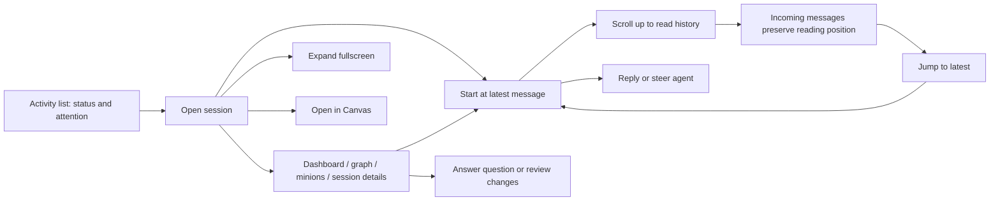
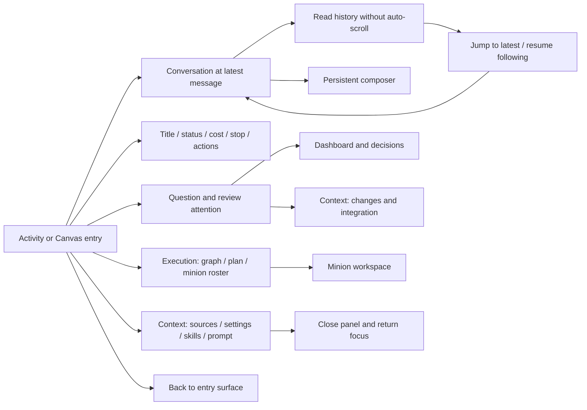

# Activity and fullscreen interaction assessment

These graphs map the current user journeys and the opportunities selected for this polish. The existing codebase and its theme tokens are the design reference.

## Activity

## Fullscreen

## Assessment

| Opportunity | Evidence and user impact | Decision |
| --- | --- | --- |
| Latest-first Activity chat | `ActivityView.tsx` scroll container has no follow behavior; opening long history starts at the oldest message. | High priority: follow on entry and asynchronous history loading; reset for each session. |
| Explicit return to latest | Activity has no return control; fullscreen's existing control depends only on message count/text and uses a fixed composer offset. | High priority: shared follow behavior, immediately available after scrolling up, positioned above the composer. |
| Stable reading | Streaming, expanded content, resizing and hidden panels can change scroll geometry. | High priority: observe content and viewport; follow only while pinned, preserve manual history position and text selection. |
| Relevant fullscreen defaults | Two open side panels consume 580px even with no execution data and no need to inspect configuration. | Show execution when it has tasks or a graph; keep context on demand, with pending changes visible. Retain user panel choices as work updates. |
| Predictable panel controls | Desktop visibility and compact overlay state are toggled together, with no expanded state, scrim or local Escape handling. | Separate the responsive visibility calculation; label controls and expose expanded state; dismiss compact panels before exiting fullscreen. |
| Return destination | Exit says “Canvas” even when entered from Activity. | Use “Back” with the existing return-to-origin callback. |
| Questions and review actions | Existing attention banners lead to dashboard forms and change review. | Preserve these outside individual view tabs so relevant decisions remain discoverable. |
| Graph duplication | Graph summary exists in execution and a context tab. | Retain secondary access for compatibility; avoid a broader context-tab reorganization in this polish. |
| New features: search, unread counts, persistent layout | Useful but require separate semantics and storage decisions. | Defer; current scope fixes navigation and layout without adding new data contracts. |

Validation: the full repository verification gate passed, including type checks, unit and component tests, system-model validation, and the production build. Installation storage-isolation tests passed. Chromium scenarios passed for desktop and mobile progressive loading, delayed content, history reading, viewport reflow, return to latest, panel dismissal, and return navigation. The viewport-reflow check exposed a scroll event arriving before ResizeObserver; the shared follow hook now preserves reading intent through that ordering, with a regression test.
