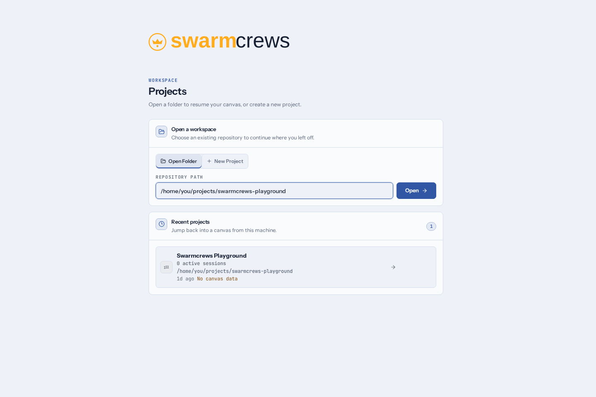
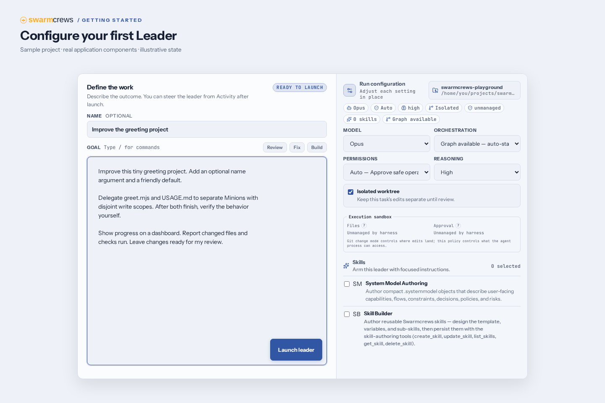
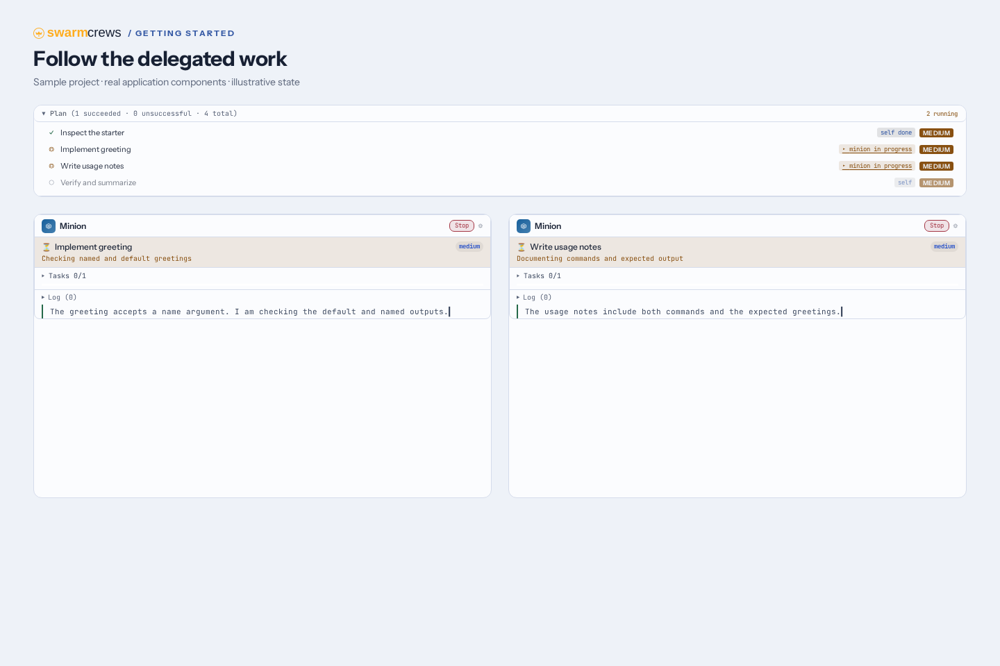
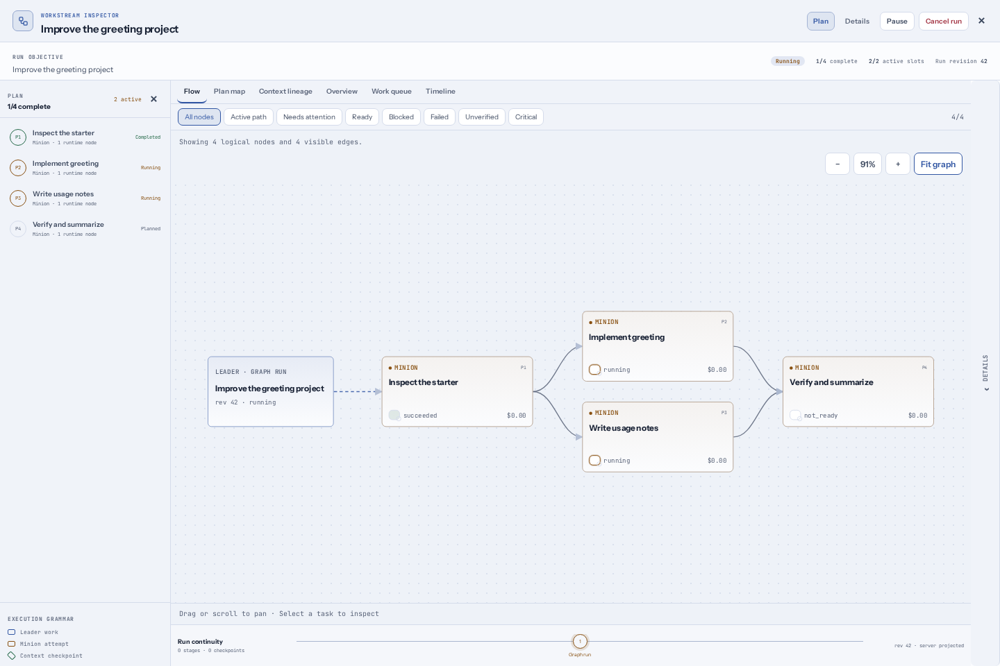
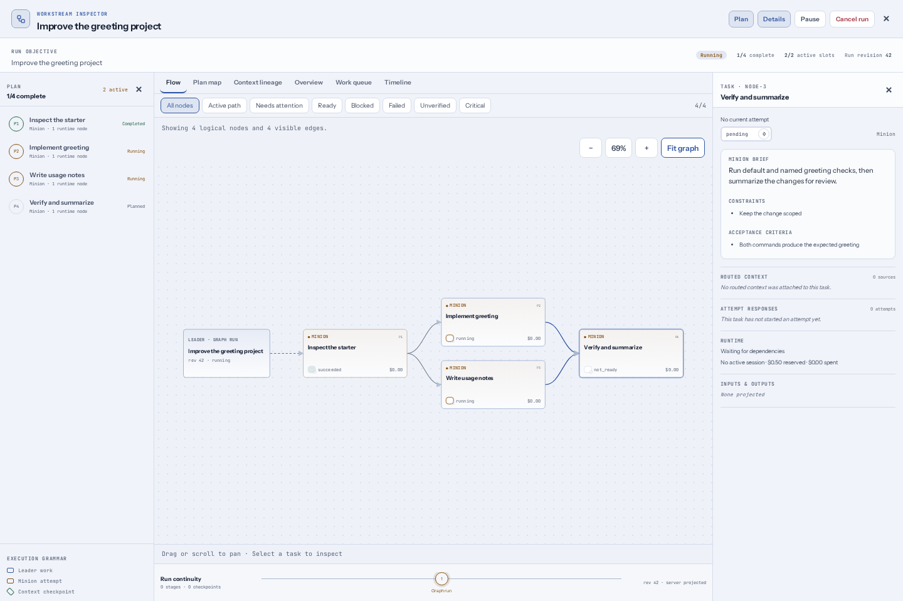
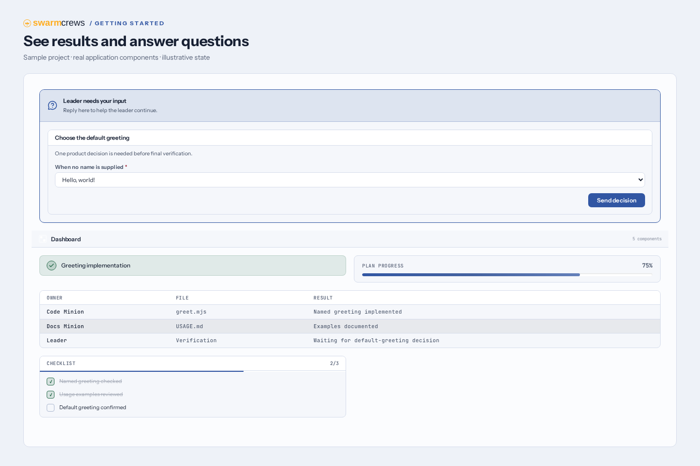

# Getting Started with Swarmcrews

[Back to the README](../README.md)

Swarmcrews is a workspace for directing coding agents. You give a **Leader** an
outcome, follow its work in **Activity** or on the **Canvas**, and review the
result. The Leader can delegate bounded tasks to **Minions**, coordinate
dependencies with a **task graph**, and present progress and questions on a
**dashboard**.

This guide takes you from installation to a first reviewed change. You can use
your own repository, or follow the small greeting-project exercise below. Allow
about 20–30 minutes after installing and authenticating an agent harness; agent
response times and usage costs depend on your provider.

The screenshots show real application components with invented project and run
data. They illustrate successive stages of the same example, rather than a
recording of a live agent run. The guide uses the Daybook theme; your theme,
model choices, and generated dashboard may differ. Click an image to inspect it
at full size. [Screenshot sources and regeneration](./screenshots/README.md)
are included for maintainers.

## Choose your path

| You want to… | Start here |
|---|---|
| Install Swarmcrews and launch a first task | [1. Install and start](#1-install-and-start) |
| Try it without bringing an existing project | [2. Prepare a practice repository](#2-prepare-a-practice-repository) |
| Understand the interface | [3. Open your project](#3-open-your-project) |
| Give a Leader a useful assignment | [4. Launch your first Leader](#4-launch-your-first-leader) |
| Delegate work and steer agents | [5. Work with Minions](#5-work-with-minions) |
| Coordinate dependencies and inspect blockers | [6. Use a task graph](#6-use-a-task-graph) |
| See progress and answer questions | [7. Use dashboards](#7-use-dashboards) |
| Supply notes, files, and screenshots | [8. Build useful canvas context](#8-build-useful-canvas-context) |
| Review, merge, and return to work | [9. Review and finish](#9-review-and-finish) |
| Reuse instructions or check in from a phone | [10. Go further](#10-go-further) |
| Unblock a setup or session problem | [Troubleshooting and support](#troubleshooting-and-support) |

## 1. Install and start

### Check the prerequisites

Install **Node.js 22 or newer**, **git**, and **pnpm**. This repository pins its
package-manager version in `package.json`; use that version if your environment
does not select it automatically.

```bash
node --version
git --version
pnpm --version
```

If pnpm is missing:

```bash
npm install -g pnpm@10.15.1
```

You also need at least one authenticated agent harness: **Claude Code, OpenAI
Codex, GitHub Copilot, OpenCode, or Pi**. Authenticate with your chosen harness on the machine
running Swarmcrews. Swarmcrews uses that harness's runtime and model catalog; it does
not supply a model-service account. Claude and Codex can use bundled SDK
runtimes; Copilot, OpenCode, and Pi must be discoverable on the server's `PATH` or through
their executable overrides.

For provider-specific setup and executable/credential overrides, see the
[README prerequisites](../README.md#prerequisites) and
[harness troubleshooting](../README.md#troubleshooting). You do not need all
five harnesses to get started.

### Install the app

Run these commands in the directory where you keep development tools:

```bash
git clone https://github.com/hipsterusername/minions.git swarmcrews
cd swarmcrews
pnpm install
pnpm preflight
pnpm start
```

`pnpm preflight` checks prerequisites, ports, native dependencies, and harness
readiness. Resolve any blocking result using its suggested remediation. A
successful check needs at least one authenticated harness; unavailable optional
harnesses do not all need fixing.

`pnpm start` starts the backend and frontend in the background and opens the
browser. If a browser does not open, visit **http://localhost:6173**.

**Checkpoint:** you see the Projects page. You do not need to configure a
database; Swarmcrews creates its SQLite state automatically.

### Keep these commands handy

Run them from the cloned **Swarmcrews application directory**, even when the
project you are working on lives somewhere else.

| Command | Use it to… |
|---|---|
| `pnpm status` | Check the background service |
| `pnpm stop` | Stop the background service |
| `pnpm restart` | Restart it after changing the server environment |
| `pnpm dev` | Run in the foreground, with logs and Ctrl-C to stop |
| `tail -n 100 .run/swarmcrews.log` | Inspect recent background-service logs |

Use either the background service or the foreground development command on a
given set of ports. [More configuration](../README.md#configuration)

## 2. Prepare a practice repository

Skip this section if you already have a project you want to use. For a first
experiment, the following Bash commands create a tiny project with no packages
to install. Choose a new directory; run the commands once.

```bash
mkdir -p ~/projects
mkdir ~/projects/swarmcrews-playground
cd ~/projects/swarmcrews-playground
git init
cat > greet.mjs <<'EOF'
console.log('Hello!');
EOF
cat > USAGE.md <<'EOF'
# Greeting project

Run `node greet.mjs` to print a greeting.
EOF
git add greet.mjs USAGE.md
git commit -m "Create greeting starter"
node greet.mjs
pwd
```

**Checkpoint:** the command prints `Hello!`, the repository has an initial
commit, and `pwd` gives you the absolute folder path to open in Swarmcrews. If Git
asks for your author identity, configure it and retry the commit before
continuing.

An initial commit gives isolated worktrees a starting revision. Keep this
practice repository separate from the Swarmcrews app clone: it is the project
the agents will edit.

## 3. Open your project

On the Projects page, select **Open Folder**, enter the absolute repository
path, or use **Browse** to select a folder, and click **Open**. Typing a partial
path also suggests matching folders. Paths refer to the server machine, including
when you connect from a phone. See [Choosing repository folders](./repository-folders.md)
for Windows paths and additional browsing locations.

[](./images/getting-started-projects.png)

*The upper card opens or creates a workspace. The lower card takes you back to
a recent project.*

**New Project** creates a workspace at a new folder path. If Swarmcrews detects
that the folder is not a Git repository, it offers Git initialization or a
choice to continue without Git. For this walkthrough, use a repository with an
initial commit so you can practice isolated-worktree review.

Once inside a project, the header switches between two views:

| View | What it is for |
|---|---|
| **Activity** | Launch Leaders, follow their activity, inspect a selected session, and review its changes |
| **Canvas** | Arrange Leaders, Minions, notes, images, and dashboards spatially; connect context to an agent |

These are two views of the project. You can switch between them while working.

### A few terms you will see

| Term | Meaning |
|---|---|
| **Leader** | The agent responsible for the overall outcome, including planning, integration, and reporting |
| **Minion** | An agent assigned a bounded piece of work by the Leader |
| **Task plan** | A list of work items and their status; a Leader can use it without a graph |
| **Task graph** | An execution plan with explicit dependencies, attempts, and, when declared, artifact handoffs and verification |
| **Dashboard** | A structured view the Leader fills with results, progress, tables, charts, or questions |
| **Context** | Notes, files, images, and other information supplied to help an agent do the work |
| **Isolated worktree** | A separate Git checkout for a task's edits, which can later be reviewed and integrated |

## 4. Launch your first Leader

In **Activity**, use the **Add an agent** area in an empty project, or **New**
if there is already activity. Give the run a short name, choose an available
model, and review the run configuration.

[](./images/getting-started-launch.png)

*Write the outcome on the left. Check the execution settings on the right
before selecting Launch leader.*

For the practice project:

1. Name the run **Improve the greeting project**.
2. Select a model from a ready harness. The screenshot's model is an example;
   use the catalog available to your account.
3. Select **Isolated worktree** to keep the task's edits separate until review.
   The current default is a shared checkout, so check this explicitly.
4. Review **Permissions** and/or **Execution sandbox**, as offered by your
   harness. Git isolation and process permissions are separate settings.
   An axis labeled **unmanaged** is not enforced by that harness.
5. Leave skills unselected for this introductory exercise.
6. Paste the prompt below and select **Launch leader**.

```text
Improve this tiny greeting project. Add an optional name argument:
node greet.mjs Ada should print "Hello, Ada!".
node greet.mjs should print "Hello, world!".

Delegate implementation of greet.mjs and documentation in USAGE.md to
two separate Minions with disjoint write scopes. Each Minion should
report what it changed and how it checked its work. After both finish,
verify the two commands yourself and compare USAGE.md with the behavior.

Show a dashboard with task status, changed files, and verification results.
Keep the change limited to these two files. Leave the changes ready for
my review; do not merge them.
```

This exercise deliberately requests delegation to teach the workflow. A Leader
can usually handle a change this small directly. In everyday work, delegate
when there are useful independent tasks, rather than requiring extra agents
for every edit.

**Checkpoint:** the Leader starts and its activity appears. You should see it
inspect the project, plan the work, and report progress. The exact wording and
division of work can vary.

### Launch from the canvas instead

Switch to **Canvas** and use **Add Leader node** in the toolbar. Configure the
Leader, enter a prompt, and select **Start**. An empty canvas also offers a
**Context description** and **Start Leader** entry point. For the isolated
practice run, use the configurable Leader node so you can check isolation
before starting.

## 5. Work with Minions

The Leader creates and connects Minion nodes automatically. You do not need to
draw delegation connections or launch each worker yourself.

[](./images/getting-started-minions.png)

*The plan shows completed inspection, two active assignments, and pending
verification. The Minion cards expose each assignment and its current step.
These components are arranged together for the walkthrough.*

### Make parallel work useful

Minions share the Leader's execution checkout. With isolation enabled, that
means the Leader's isolated worktree; workers do not each receive an independent
branch by default. Give concurrent editing tasks disjoint file ownership.
Swarmcrews rejects declared overlapping write scopes during assignment.

For this exercise, the code Minion owns `greet.mjs` and the documentation Minion
owns `USAGE.md`. The Leader checks their agreement after they finish. In a larger
project, two tasks that both need the same shared file may need to run in
sequence, or the Leader can own that integration edit.

### Observe, then steer

Open the task plan to see assignment status. On the canvas, inspect a Minion's
task and log when you need detail; use **Fit view** or **Auto-arrange nodes** if
the workspace becomes difficult to navigate.

Send changes of direction to the Leader so it can coordinate affected work:

```text
Keep the public interface unchanged apart from the optional name.
If either Minion needs another file, explain why before expanding scope.
```

Or request a progress explanation:

```text
Which tasks are complete, which are blocked, and what evidence remains
before this is ready for review?
```

Use **Stop** on an agent when you need to interrupt its execution. Stopping
does not undo edits already made. Inspect the resulting state before resuming
or starting replacement work.

**Checkpoint:** the plan identifies who owns each task, and the final report
distinguishes the workers' results from the Leader's verification.

## 6. Use a task graph

Graph is always enabled and is the standard path for Leader assignments to
Minions, including single-step assignments. Dependencies let a Leader inspect
first, run independent tasks, then verify the combined result. Leaders can
still perform local work themselves without creating a graph.

To practice, start a separate Leader on the starter project, or use a fresh
copy of it after finishing your first run. Select **Graph — review before start** if you want to inspect the proposed plan before it starts.
Ask explicitly:

```text
Use a task graph for the greeting project. Inspect the starter first.
Add an optional name argument: node greet.mjs Ada must print
"Hello, Ada!", and node greet.mjs must print "Hello, world!".
Then run two independent tasks: implement greet.mjs and update USAGE.md,
with separate file ownership. Make a final verification task depend on
both tasks. It must run the default and named greeting commands and
report whether the documentation matches.

Keep the graph small. Show me the dependencies and acceptance criteria.
Leave the changes for my review without merging.
```

[](./images/getting-started-graph.png)

*Read from left to right. The two middle tasks can run independently. The final
task waits for both incoming dependencies.*

### Review the plan and follow execution

1. Open the graph from its summary card with **Open graph**.
2. Read the objective, tasks, acceptance criteria, and dependency structure.
3. If the selected mode requires approval, approve the exact proposed plan
   through the presented review control. Ask the Leader to revise it first if
   the scope or dependencies are wrong. In auto mode, an eligible plan can
   begin without this review step.
4. Use **Flow** to follow dependencies and **Fit graph** to bring the graph
   into view. Select a task for its details.

[](./images/getting-started-graph-detail.png)

*A selected task explains what must happen before it counts as complete. A task
waiting on predecessors is not necessarily broken.*

| Inspector tab or filter | Use it to answer… |
|---|---|
| **Flow** | Which tasks depend on which other tasks? |
| **Plan map** | How does the authored plan relate to execution? |
| **Context lineage** | Where did declared artifacts come from, and which tasks consumed them? |
| **Overview** | What is the overall execution state? |
| **Work queue** | Which tasks are ready, queued, or waiting? |
| **Timeline** | What happened, and in what order? |
| **Needs attention**, **Blocked**, **Failed**, **Unverified** | Which tasks need a closer look? |

Context lineage is useful when the plan declares artifact handoffs. A graph
without such handoffs can have little or no artifact evidence to show.

### When a graph pauses or fails

Select the affected task and read its blocker or attempt result before taking
action. A dependency wait, a missing user answer, an exhausted retry policy, and
a failed verification need different remedies.

Ask the Leader to resolve the underlying issue. Use the inspector's available
controls—such as **Retry**, **Pause**, or **Resume**—when appropriate. A retry
creates another attempt and can consume more provider usage; it does not repair
a missing prerequisite on its own. Some controls are unavailable for terminal
or otherwise ineligible states.

**Checkpoint:** all required tasks and any required verification have passed,
and the Leader has synthesized the results. A completed graph is still
separate from approving or merging Git changes.

## 7. Use dashboards

A dashboard makes a long-running task easier to follow without reading every
log entry. The Leader can create and update status cards, checklists, tables,
charts, code blocks, and forms. Ask for the information you need in plain
language; you do not need to write the Render DSL yourself.

```text
Keep a dashboard with a task checklist, a table of changed files and
owners, and the actual verification results. Update it as work finishes.
Clearly distinguish checks that passed from checks that have not run.
```

[](./images/getting-started-dashboard.png)

*Results stay visible below the question. In this illustrative variation, the
default greeting is still undecided; the exact prompt in section 4 already
specifies it, so your run may not need this question.*

### Answer a question

When the Leader presents a form, choose or enter your answer and press that
form's submit button. Selecting a default or typing a value alone does not
submit it. The answer returns to the session so the Leader can continue.

To practice a dashboard decision in a later task:

```text
Before changing the default greeting, show me a dashboard form choosing
between "Hello, world!" and "Hello, friend!". Wait for my answer, then
update the implementation and usage notes consistently.
```

Dashboards are authored by the agent. Treat a progress percentage as a summary
and inspect the reported checks and changed files before approving work. For
execution state, use the task plan and graph inspector alongside the dashboard.

The embedded **Dashboard** view lives with the Leader. A separate Dashboard
node is also available on the canvas. Generated HTML previews are static;
use dashboard forms for decisions that need to return to the agent.

**Checkpoint:** you can find the latest result, identify remaining work, and
submit any pending question without searching through the transcript.

## 8. Build useful canvas context

Use **Canvas** when the task benefits from seeing related material together.
The toolbar and canvas context menu offer node creation; files and directories
can also be dragged into the canvas.

| Material | How to use it |
|---|---|
| **Markdown** | Add a short brief, acceptance criteria, or decisions that should stay visible |
| **Image** | Add a screenshot or diagram and explain what the agent should notice |
| **File Viewer / Folder** | Drag in a file or directory to expose relevant project material |
| **Context Group** | Collect related context nodes into a spatial group |
| **Leader output / Dashboard** | Reuse selected results as context for follow-up work |

Connect a context provider's output port to the Leader's compatible input port
so the material is included as context. Placing a note nearby helps you see it,
but proximity alone is not a substitute for the context connection. Inspect the
Leader's connected context before launching or sending a follow-up.

Try a Markdown note with:

```text
Acceptance criteria
- No dependencies are added.
- A supplied name appears verbatim in the greeting.
- Missing names use the agreed default.
- USAGE.md contains commands and expected output.
```

For a visual task, attach the relevant screenshot and give a concrete request:

```text
Use the connected screenshot as the reference. Focus on the spacing
between the heading and form. Preserve the existing behavior and report
which files changed.
```

Keep context focused. A short relevant brief and a few files are often more
useful than forwarding an entire repository or transcript. When forwarding
another Leader's work, choose the available dashboard, lean, or full context
mode according to how much detail the next task needs.

## 9. Review and finish

For the isolated practice run, open the Leader in **Activity** and inspect its
changes panel when the work is ready for review. Review also has canvas
controls; conflict cases can link you to **Open in Canvas** for resolution.

Before integrating, check three things:

1. **Scope:** the changed-file list contains only `greet.mjs` and `USAGE.md`.
2. **Behavior:** the final report includes the actual default and named-command
   results, and the implementation matches those results.
3. **Agreement:** `USAGE.md` describes the implemented behavior accurately.

If a check is missing, send a follow-up:

```text
Before I review this, run both documented commands in the execution
worktree and show their exact output. Explain any remaining limitation.
```

### Approve the contribution and integrate it

Current work-item sessions show a **Lineage** strip. A lineage tracks the
contributions being combined before they reach the target branch.

1. Use **Approve contribution** when the reviewed change is satisfactory, or
   **Request changes** when another iteration is needed.
2. Wait for the review receipt. **Approved · awaiting integration** means the
   approval was recorded, but integration is still outstanding.
3. Use **Expand lineage** to inspect the contribution and combined work. Follow
   the available integration controls until the intended contributions are
   integrated and required checks are satisfied.
4. Review the combined result and use **Approve combined lineage** when it is
   ready. This is a separate review from approving an individual contribution.
5. Use **Promote to …**, checking the displayed target branch, and confirm the
   resulting integration state before checking the original repository.

Older session surfaces can show **Merge** and **Discard** instead. Follow the
controls and confirmations offered for that session. If the target has changed,
resolve the reported conflict or use the offered check/sync flow before retrying.
Check the result receipt rather than assuming a click completed the operation.

**Discard** or **Discard contribution** abandons the isolated work. Follow any
confirmation shown and use it only when you do not want to retain that work.
It is different from stopping an agent.

If you chose a **shared checkout**, edits already land in that checkout. The
isolated-worktree merge boundary does not apply; inspect the working tree and
use your normal Git review process.

### Verify the exercise after integration

From the original practice repository:

```bash
cd ~/projects/swarmcrews-playground
node greet.mjs
node greet.mjs Ada
git status --short
```

Expected output for the two Node commands:

```text
Hello, world!
Hello, Ada!
```

If you intentionally chose another default through a form, use that agreed
output instead. `git status --short` helps you check for remaining local edits.

**Checkpoint:** the original repository contains the intended result, the
review/integration outcome is confirmed, and you know whether any work remains.

### Return later

Open Swarmcrews again and select the project from **Recent projects**. Canvas
state and session history are persisted. Read the latest activity, pending
questions, and review state before resuming; restoring a page is not evidence
that interrupted work finished successfully.

Swarmcrews normally stores project state and owned worktrees under `~/.swarmcrews`,
outside your source repository. If moving a repository or changing
`SWARMCREWS_HOME`, follow the [storage and migration instructions](../README.md#workspace-storage-and-migration)
so you retain the correct workspace identity and pending work.

## 10. Go further

### Skills: reuse a working method

Skills package instructions for a recurring kind of work. In the launch form,
select the relevant skill and fill any required variables. For example, a
review skill can give repeated review tasks a consistent process. Select only
skills relevant to the assignment; the available inventory can vary by project.

Use the Skills browser to explore or launch configured templates. Start with
one skill and a concrete prompt so you can see how it affects the result.

### Project context and settings

Put durable project conventions in project context: the test command, important
directories, and boundaries an agent should respect. Use a run prompt for
task-specific acceptance criteria. Settings and skills are workspace-owned, so
verify them when switching projects.

### Mobile companion

For tailnet access, install and sign in to Tailscale on the host and your phone,
then start Swarmcrews with:

```bash
pnpm start -- --tailscale
```

Open `https://<machine>.<tailnet>.ts.net:6173/m` on your phone. The mobile
companion lets you follow activity and continue conversations. Push
notifications require a secure context; use **Enable notifications** there.
On iOS, follow the Home Screen installation requirements in the
[mobile setup instructions](../README.md#mobile-access-over-https-tailscale).

### Copyable prompts for your next task

**Understand a repository before editing:**

```text
Explain how this project starts, where its main behavior lives, and how
to run its checks. Make a dashboard with the key files and commands.
Do not modify files.
```

**Investigate a bug with focused delegation:**

```text
Investigate this failure: [paste the symptom and reproduction steps].
Delegate independent read-only checks of the likely causes to Minions.
Compare their evidence, reproduce the failure, then make the smallest
fix with a meaningful regression check. Leave it ready for review.
```

**Deliver a feature with dependencies:**

```text
Use a small task graph to implement [feature]. First inspect the existing
contracts. Split independent work by file ownership, then verify the
integrated result. Show dependencies, acceptance criteria, blockers,
and the final evidence. Ask for any missing product decision in a form.
```

## Connect apps and MCP tools

Open **Settings → Connections** in a project, or **Connections** in the canvas dock.
On mobile, open the project's **Settings**. Select **Add connection** and paste a
server URL, a Claude/Codex install command, or MCP JSON. Review the imported fields
and select **Save & test connection**. If the server requires OAuth, select
**Sign in**, finish in the new tab, return, and test again.

A successful test shows **Verified** and the available tools. Expand
**Explore capabilities**, then ask an agent to use the connection by name.
Swarmcrews supplies discovery and invocation tools to leaders and child agents
across Claude Code, Codex, Copilot, OpenCode and Pi. Saved connections become
available on the next request; no per-harness MCP configuration or restart is needed.
Existing sessions started before this application upgrade need a new turn to
receive the shared connection tools.

You can also ask a Leader to add or configure a server in the project's
Connections catalog. Leaders can save HTTP, SSE, or local command settings,
credentials, enabled state, and tool restrictions, then test the connection.
Existing credentials stay masked when the Leader reads configuration. Plan-mode
Leaders can read settings; saving requires an execution run. OAuth browser
sign-in still takes place in **Connections**.

**Verified** records the last successful check. **Retry connection** checks a
failure again; **Edit** changes configuration; **Disable** immediately prevents
further requests. **More → Clear sign-in** clears locally saved OAuth credentials.
**Remove** deletes the connection and its saved sign-in. Disabling or removing a
connection cannot undo an external operation that has already run.

Remote servers use HTTPS (local HTTP is supported for development); Streamable
HTTP is the default, with legacy SSE under advanced settings. Local commands run
on the Swarmcrews host from the project's source folder with the host user's
permissions. These permissions are independent of a harness's filesystem sandbox.
Environment values, headers and OAuth secrets are kept in private workspace
storage and masked when settings are read. Add only servers you intend the
project's agents to use; optionally restrict their tool names in advanced settings.

Swarmcrews also exposes MCP resource reads and prompts. The current cross-harness
result format is JSON text, bounded to 1 MB per response; binary/image results
aren't rendered as native model images. Servers that need interactive sampling or
elicitation during calls aren't supported by this connection client yet.

## Troubleshooting and support

| Symptom | What to check next |
|---|---|
| `pnpm` is missing or Node is too old | Recheck the versions in [step 1](#1-install-and-start), then reinstall dependencies |
| Installation fails while building `better-sqlite3` | Install the platform's C++ build tools; see [native-module troubleshooting](../README.md#troubleshooting) |
| No usable model, or launch says unavailable | Run `pnpm preflight`; confirm your chosen harness is authenticated and visible to the server process, then refresh readiness or restart |
| Harness works in a terminal but not in Swarmcrews | Compare executable paths and environment; the background server must inherit the credentials and overrides it needs |
| Browser cannot reach the app | Run `pnpm status`, check `.run/swarmcrews.log`, and open `http://localhost:6173` |
| A port is busy | Check for an existing instance first. `PORT` changes the backend port; `VITE_PORT` changes the browser-facing port. Use a free port for the one that conflicts |
| Project cannot use isolation | Verify the folder is a Git repository with an initial commit and that the path is correct |
| No Minions appear | A small task may be handled directly. Ask explicitly for bounded delegation, and inspect the plan for assignment errors or blockers |
| No graph appears | Graph is always enabled for Minion assignments. A Leader may be doing local work; inspect its progress and selected review mode |
| Graph is blocked | Select the blocked node and read the reason. Resolve missing input, dependencies, or failed checks before retrying |
| Dashboard is empty | Ask the Leader to render a dashboard with specific fields; dashboards are created by the agent as needed |
| Form is still pending | Fill required fields and press its submit button; inspect submission feedback and connection state |
| Original files still look unchanged | The task may be in an isolated worktree. Inspect review/integration state before expecting changes in the source folder |
| Merge cannot proceed | Read the review feedback, check the current target, and use the offered sync/conflict-resolution flow |
| Canvas looks empty or nodes are offscreen | Confirm the selected project, then use **Fit view** or **Auto-arrange nodes** |
| Mobile says notifications unsupported | Use tailnet HTTPS and follow the platform requirements in [mobile setup](../README.md#mobile-access-over-https-tailscale) |

### Ask for help effectively

For reproducible bugs or documentation gaps, use the repository's
[GitHub issues](https://github.com/hipsterusername/minions/issues). Search
existing reports first. A useful report includes:

```text
What I expected:
What happened instead:
Steps to reproduce:
Swarmcrews commit (git rev-parse --short HEAD):
OS, Node version, and pnpm version:
Harness and selected model:
Shared checkout or isolated worktree:
Relevant preflight result and short log excerpt:
Screenshot of the affected control, with private content removed:
```

Do not include credentials, private repository contents, or full local
transcripts in public reports. Report suspected vulnerabilities privately using
[SECURITY.md](../SECURITY.md).

For contribution instructions, see [CONTRIBUTING.md](../CONTRIBUTING.md). For
configuration, service commands, architecture, and storage details, return to
the [README](../README.md).
