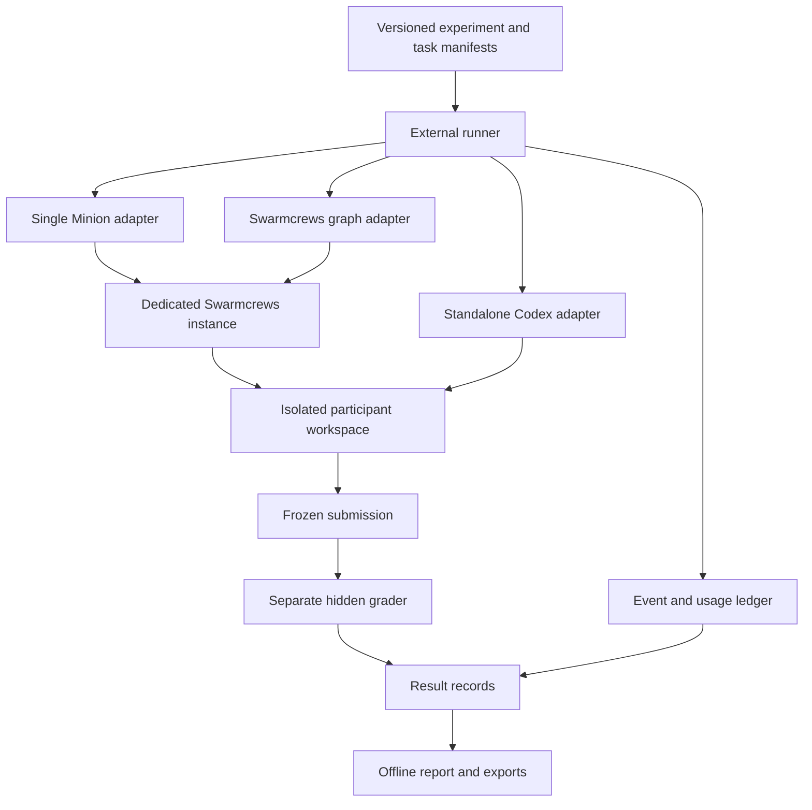

# Independent agent evaluation system

Status: proposed implementation specification. This document defines a future
library; it does not claim that the commands or APIs below exist today.

## 1. Purpose and boundaries

Build a separately runnable `evals/` package that measures how execution mode
affects task correctness, token consumption, and elapsed time. The first suite
compares one Minion acting as the task owner, a Swarmcrews Task Graph, and a raw
Codex session initiated outside Swarmcrews. The same framework must accept new
tasks, execution adapters, graders, and report views without changing its core
scheduler.

The evaluator is deterministic software, not another agent. It prepares runs,
launches participants, observes execution, enforces limits, captures artifacts,
grades results, and renders reports. It must not coach participants, repair their
patches, choose their decomposition, or supply hidden-test feedback.

Required boundaries:

- `evals/` has its own package manifest, lockfile, TypeScript configuration, CLI,
  test commands, and build output. It can be installed and tested independently.
- Application code under `src/`, `server/`, and `shared/` must not import the
  evaluator. Evaluator runtime code must not import application internals or
  execute the application's command handlers in process.
- The Swarmcrews server is a system under test, started as a separate process in a
  dedicated environment. Running that server is necessary for real Swarmcrews
  execution; running the evaluator inside it is forbidden.
- The CLI and reports work without the canvas UI. Raw Codex execution requires
  neither a running Swarmcrews server nor Swarmcrews MCP tools.
- Normal application startup, build, and tests must not launch paid evals.
  Live runs require an explicit CLI invocation and a validated experiment plan.
- Version one targets Linux with a container-capable isolation backend. A local
  directory backend may support development, but is not eligible for controlled
  comparisons with hidden ground truth.

This version excludes model training, production deployment, subjective visual
quality judging, and automatic publication of reports. Browser-based behavioral
tests and local interactive reports are included.

## 2. Architecture and package layout



The diagram shows alternative paths. Every run receives its own workspace and
state; different modes never share the illustrated workspace or Swarmcrews instance.

Proposed layout, to be created during implementation:

```text
evals/
  README.md
  SPEC.md
  package.json
  pnpm-lock.yaml
  tsconfig.json
  src/
    cli/                 # commands and machine-readable exit results
    core/                # manifests, scheduler, lifecycle, registry
    adapters/            # minion-single, minion-graph, codex-raw
    isolation/           # environment provisioning and teardown
    telemetry/           # raw usage conversion and event deduplication
    graders/             # test suite, structured output, browser behavior
    reports/             # aggregation, interactive HTML, CSV/JSON export
  schemas/               # versioned manifest, event, and result schemas
  suites/                # task selections and experiment profiles
  tasks/<task-id>/        # task definition, public prompt, fixture recipe
  ground-truth/<task-id>/ # grader-only oracle and hidden acceptance cases
  tests/                 # cross-module contracts and lifecycle integration
```

Ground truth may be versioned alongside the library for review, but the entire
library checkout must never be mounted into a participant environment. Hidden
means unavailable during execution, not a guarantee against prior model exposure.
Record whether tasks are public, private, or generated from withheld seeds.

## 3. Experiment model and reproducibility

A **task** defines a problem and its observable acceptance criteria. A **suite**
selects tasks. A **condition** selects an adapter and its resolved settings. A
**cell** is one task/condition/repetition combination. A **run** is one execution
attempt for a cell, with a unique ID. A **submission** is its immutable final
filesystem snapshot. A **grade** evaluates that submission using a pinned grader.

Before launch, expand the suite into an immutable `experiment.lock.json`:

| Required field | Meaning |
| --- | --- |
| Schema and experiment IDs | Explicit schema version and unique experiment identity |
| Task and grader revisions | Content hashes for prompt, fixture, oracle, and acceptance criteria |
| Participant implementation | Swarmcrews commit/build digest where applicable; Codex binary version and digest |
| Resolved model settings | Requested and resolved model, reasoning effort, service tier, context/compaction settings where exposed |
| Environment | Image digest, OS/architecture, dependency lock hashes, CPU/memory limits, network policy |
| Treatment configuration | Prompt templates, skills, tools, orchestration policies, integration policy, child concurrency |
| Repetition design | Repetition count, fixture seeds, scheduling seed, exact randomized run order |
| Limits | Per-task aggregate token cap, execution deadline, preparation/grading deadlines, storage limit |
| Provenance | Evaluator revision, adapter/normalizer versions, preparation commands and content digests |

Unresolved model settings, unsupported isolation, absent ground truth, and
incompatible adapter versions fail preflight. Do not silently fall back to a
different model or weaker isolation. If an immutable provider model snapshot is
unavailable, record the resolved identifier and that limitation.

The default controlled profile supplies identical task prompts, repository
instructions, tools for doing the work, fixture inputs, model settings, resource
limits, and skill/context material wherever the modes permit. Mode-specific
orchestration prompts and tools are deliberate differences and must be captured.
Optional Swarmcrews-only context or skills belong in a separately named profile.

Use the same generated fixture seed across modes within a repetition. Fixture
and scheduling seeds do not imply deterministic model responses. Fresh provider
history does not guarantee a cold provider cache; record observed cache usage.

One cell runs at a time by default to reduce machine contention. Graph children
may run concurrently within that cell, with a fixed cap of three active children
for the initial profile. A concurrent throughput experiment is a separate profile.
Any dirty implementation snapshot must be deliberately exported, hashed, and
recorded; never benchmark whatever happens to be in a changing checkout.

## 4. Extension contracts

Registries map versioned IDs to adapters, isolation backends, graders, and report
views.
Manifests select those IDs; the scheduler contains no task-name branching.
Plugins are explicitly configured local modules, not dynamically downloaded code.
Unknown schema versions fail validation with a migration message.

### Task definition

The implementation must provide a runtime schema corresponding to this contract:

```ts
interface TaskDefinition {
  schemaVersion: 1;
  id: string;
  revision: string;
  family: string;
  difficulty: "simple" | "complex";
  promptFile: string;
  fixture: {
    builderId: string;
    configFile: string;
    imageDigest: string;
  };
  requiredCapabilities: string[];
  submission: {
    include: string[];
    exclude: string[];
    maxBytes: number;
  };
  criteria: Array<{ id: string; description: string; mandatory: boolean }>;
  grader: { id: string; revision: string; configFile: string };
  limits: {
    maxTotalTokens: number;
    executionTimeoutMs: number;
    preparationTimeoutMs: number;
    gradingTimeoutMs: number;
  };
}
```

Task paths resolve within the task package; reject traversal and escaping
symlinks. The full task manifest remains controller-side. Participants receive
only the prompt, public requirements, visible tests, and prepared fixture. Hidden
case details and grader configuration do not enter their context.

Adding a task requires its public contract, fixture builder/configuration,
criterion mapping, independent grader, reference solution, and validation evidence
that the reference passes and relevant defective variants fail. Reuse an existing
grader where possible. Bump the task revision when observable expectations change.

### Execution adapter

```ts
interface ExecutionAdapter {
  id: string;
  version: string;
  preflight(config: AdapterConfig): Promise<CapabilityReport>;
  start(run: ParticipantRunSpec): Promise<RunHandle>;
  observe(handle: RunHandle, afterSequence?: number): AsyncIterable<RunEvent>;
  inspect(handle: RunHandle): Promise<ExecutionSnapshot>;
  stop(handle: RunHandle, reason: StopReason): Promise<StopReceipt>;
  collect(handle: RunHandle): Promise<CollectedExecution>;
}
```

Supporting types must be versioned and runtime-validated. `ParticipantRunSpec`
contains only participant-visible inputs, execution configuration, resource
handles, and limits. It contains no oracle paths. `RunHandle` is a durable opaque
identity usable after runner restart. `start` accepts an idempotency key derived
from the run ID; repeating it must not spawn another participant.

`CapabilityReport` describes model configuration, delegation controls, lifecycle
recovery, usage granularity, cancellation, artifact collection, and protocol
versions. `ExecutionSnapshot` reports authoritative state and the full participant
tree. `CollectedExecution` provides artifacts, graph/session provenance, usage
coverage, and log truncation indicators. `stop` is idempotent and accounts for all
descendants. A disconnect is not a completion signal.

Adding an adapter requires contract tests for launch, reconnect, failure,
cancellation, complete descendant discovery, and usage conversion. Required
capabilities must be satisfied before any paid calls for the experiment.

### Grader

```ts
interface Grader {
  id: string;
  version: string;
  grade(input: FrozenSubmission, context: GraderContext): Promise<GradeResult>;
}
```

Grading runs in a separate environment containing the submission, pinned
dependencies, and grader-owned cases. It has no provider credentials, Swarmcrews
control access, or participant session. Check IDs map back to public criterion
IDs, while case details remain hidden until the participant has terminated.

`GradeResult` includes grader revision, submission hash, per-criterion verdicts
(`pass`, `fail`, `error`), expected/observed evidence, regression results, and
log references. A grader infrastructure error is distinct from a valid failing
test. A build failure caused by the submission is a task failure. Additional
graders must pass known-good, known-bad, timeout, and malformed-output tests.

### Task metrics and report extensions

Graders may emit additional namespaced metrics, such as `queue.lostJobs` or
`report.exceptionRecall`, alongside criterion verdicts. Each metric definition
declares its ID, description, numeric/boolean type, unit, scope (check, submission,
or run), preferred direction, missing-value meaning, and allowed aggregation.
Metric values reference their definition revision and supporting evidence. They
must not overwrite reserved correctness, usage, or timing fields.

Core reports display unknown task metrics in a generic table. Optional report
views consume only versioned result/metric records through a registered renderer;
they do not inspect live participant state or add task-specific branches to the
scheduler. Renderers must satisfy the same offline, escaping, accessibility, and
missing-data rules as built-in views. Metric definitions with different units or
revisions cannot be combined automatically. Adding a metric or a custom view
does not change historical full-success criteria unless the task revision changes.

## 5. Initial execution modes

| Mode | Required behavior |
| --- | --- |
| `minion-single` | One Minion receives the whole assignment and owns planning, implementation, and verification. No child delegation or graph execution is available. Record the actual runtime role and prompt; “acting as leader” describes responsibility, not a claim that its prompt matches the canonical Leader. |
| `minion-graph` | A fresh canonical Leader receives the same assignment and creates its own graph. The server schedules children. Leader review, graph revision, retry, integration, and continuation costs all count. |
| `codex-raw` | The external runner launches a standalone Codex process directly, using fresh state and no Swarmcrews orchestration tools. Native sub-agent delegation is disabled for this baseline. |

“One shot” means one initial assignment without human follow-up, not one model
request. All modes may inspect files, edit, run visible tests, and self-correct
within their limits. The graph mode must materialize and execute a decomposition
with at least two meaningful bounded nodes. A leader that completes everything
directly has violated that condition even if its submission passes grading.

The evaluator must not provide graph topology. Preserve the authored topology,
node contracts, attempts, ownership boundaries, and final integration provenance.
For graph child worktrees, collect the final integrated task workspace; do not
assemble an improved submission from unintegrated child branches.

Enforce delegation restrictions with available tool/configuration controls and
record evidence. A prompt alone is insufficient to claim enforcement. If the
target version lacks required controls, mark the adapter unsupported until the
gap is resolved. Restrict out-of-band provider/agent launches through the execution
environment as well as through the advertised tool inventory.

Configure graph review/start and routine integration policies before launch so
execution can proceed unattended. Use supported lifecycle paths; do not spoof
human decisions or bypass review gates. Unexpected requests for human input end
as `blocked`, with their cause recorded. Any mechanical launcher overhead counts;
an unavoidable model-based bootstrap also counts and must be disclosed.

### Existing integration evidence and implementation gaps

These repository files are integration references, not library dependencies:

- [Session command schemas](../server/commands/schemas.ts) describe external
  launch fields, roles, model selection, and session configuration.
- [Graph command schemas](../server/commands/task-graph-schemas.ts) and the
  [graph test harness](../tests/e2e/task-graph-harness.mjs) provide protocol
  examples. Reuse real protocol behavior, not its fake execution fixtures.
- [Run configuration](../server/work-item-run-config.ts) records model and
  orchestration settings; the adapter must capture resolved settings too.
- [Usage capture](../server/session-usage-capture.ts), [usage storage](../server/usage-telemetry.ts),
  and [Codex translation](../server/harness/codex/translate.ts) expose current
  accounting semantics.

The implementation spike must verify external terminal-state detection, complete
session-tree enumeration, headless graph startup, delegation restriction, and
usage export. Existing code does not establish all of these capabilities as a
stable public API. If a required capability is missing, record it as an adapter
prerequisite and implement a separately reviewed general-purpose app interface.
Do not silently substitute browser clicking or in-process server imports.

Prefer externally exported usage. A version-fenced read-only snapshot of the
dedicated instance's SQLite store is an acceptable temporary collection mechanism,
provided it includes WAL state consistently and runs after writes are quiescent.
It must never read the developer's live application database or mutate runtime
records. Database schema assumptions need adapter contract tests.

## 6. Isolation and ground truth

Create independent state for every run: participant filesystem, user/configuration
directories, provider history, Git metadata, application database, workspace
registry, temporary directories, ports, and writable dependency caches. All graph
participants belong to the same run boundary. No host socket, broad home mount,
other run directory, or grader checkout is exposed to participant tools.

Use container/VM boundaries for measured execution; a Git worktree alone is not
isolation. Build the public fixture from an allowlisted export and initialize a
new repository inside the boundary. Do not preserve commits, remotes, reflogs, or
object databases that contain the reference solution or another run's output.
Read-only dependency layers may be shared only when immutable and content-addressed.

Separate controller-side application state from agent tool access. Supply provider
authentication only to the runtime that needs it, preferably through a scoped
broker; never include credential values in artifacts or shared fixture files.
Allow only declared provider/control traffic. Benchmark tasks use local services
and offline fixtures; setup installs dependencies before measurement. Participant
tools must not reach arbitrary internet sources containing ground truth.

The grader treats the submission as untrusted executable code. Execute it with
resource limits and no network or host credentials. Keep the grader's expected
values and result writer outside submission-controlled code where practical;
run black-box inputs against the application/CLI and evaluate outputs externally.
Never trust participant-edited tests or a participant-generated success report.

Fixture publication requires evidence that:

1. The reference implementation passes every mandatory acceptance check.
2. The starting snapshot fails intended checks, while unrelated baseline behavior
   remains valid.
3. Deliberate faulty variants fail checks targeting their specific defects.
4. Repeated grading of a frozen submission is stable; races use deterministic
   barriers/fake clocks and specified crash points rather than arbitrary sleeps.
5. Participants cannot read oracle paths, previous-run state, or host secrets.

Snapshot final files only after stopping all writers. Include tracked changes,
deletions, and eligible untracked files, with file modes and content hashes.
Apply declared size limits and reject escaping symlinks, devices, and traversal.
Retain a diff for review, but grade the full snapshot, not just committed changes.

## 7. Run lifecycle, limits, and recovery

```text
planned → preparing → ready → running → stopping → collecting → grading → finalized
```

Persist transitions and external identities before acknowledging them. Preparation
failures can finalize without launch. Every launched run must reach a terminal
execution outcome, even if collection or grading fails. Keep execution outcome,
grade outcome, and telemetry completeness as separate fields.

Execution outcomes: `completed`, `failed`, `blocked`, `timeout`, `budget_exceeded`,
`cancelled`, `infra_error`, or `interrupted`. Preparation errors use `infra_error`
with `launched: false`. Grade outcomes: `passed`, `failed`, `error`, or `not_run`.
Protocol adherence: `valid`, `violated`, or `unverified`, with evidence/reasons.
Missing usage does not change the correctness grade; it changes efficiency
eligibility.

Completion requires the adapter's authoritative task-terminal signal, all known
participants terminal, and no queued child/retry/continuation work. A final-looking
message, an idle Leader awaiting children, or a quiet socket is not sufficient.
Capture the terminal evidence before stopping the dedicated runtime. Where the
protocol cannot establish quiescence, fail capability preflight rather than using
a fixed sleep as proof of completion.

A full success requires `completed`, a passing grade including all mandatory
criteria and regression gates, and valid protocol adherence. Partial submissions
from failures/timeouts may be graded for diagnosis, but cannot become full
successes. Skipped mandatory checks never count as passed.

The measured execution clock starts immediately before adapter launch, including
Swarmcrews process startup and graph planning, and ends after all participant
processes have stopped. Prebuild dependencies and fixture images before this
clock. Record preparation, execution, collection, grading, report time, and total
orchestration time separately. Use monotonic durations plus UTC event timestamps.

Token caps apply to the sum across the run, not per child. When usage is emitted
only at turn boundaries, token enforcement is best effort: stop admitting new
work and cancel active work at the first observed breach. Record reporting lag,
actual totals, cap overshoot, and whether unreported in-flight usage remains.
Never claim an exact hard token cap if the provider cannot enforce one. The
external wall-time watchdog remains authoritative even during silent model calls.

Cancellation requests graceful shutdown, waits a configured bounded grace period,
then terminates the run's container/process group and descendants. Cleanup verifies
no processes or bound ports survive. Preserve evidence before removing temporary
state, and redact credentials before any report export.

After a runner restart, reconcile durable run handles with actual external state.
Reattach to a surviving run and replay events without relaunching it. Do not
reset its deadline or aggregate budget. If no participant survives, finalize as
`interrupted`; do not silently start a fresh model session under the same run ID.
Resume schedules only unfinished cells or explicitly requested replacement runs.
Uncertain launch state must be resolved or terminated before admitting replacement
work, preventing duplicate paid execution.

Default to no automatic whole-run retries. Agent self-corrections and graph-node
retries remain inside the run and count toward its limits. Explicit replacements
get new IDs linked to originals; retain all original outcomes and usage. Primary
analysis uses the first launch per cell, with replacements shown separately.

## 8. Events and token accounting

Write an append-only event ledger with schema version, experiment/run ID, unique
event ID, monotonically increasing ingestion sequence, observed timestamp,
adapter/source identity, participant/session/turn IDs where available, event type,
and payload. Preserve provider timestamps separately. At minimum record lifecycle,
participant discovery, graph changes, usage, stop decisions, artifact references,
errors, and grade publication.

Normalize usage into the following fields for each uniquely identified observation:

| Field | Definition |
| --- | --- |
| `inputTokensTotal` | All input tokens, including cache reads/writes when included in provider input accounting |
| `inputTokensUncached` | Ordinary uncached input, only when derivable without ambiguity |
| `cacheReadTokens`, `cacheWriteTokens` | Explicit cache categories, not extra additions to total input |
| `outputTokensTotal` | Provider-reported total output |
| `reasoningTokens` | Reported reasoning subset where available; never added again to inclusive output |
| `totalTokens` | `inputTokensTotal + outputTokensTotal` |
| `reportedCostUSD`, `estimatedCostUSD` | Separate values with billing scope or pinned pricing provenance; nullable |
| `coverage` | `complete`, `partial`, or `unavailable`, with reasons and covered participant/turn identities |

Every adapter declares whether source values are per-event deltas, per-turn
snapshots, or cumulative session snapshots. Upsert revisions of the same source
identity, and derive deltas from cumulative observations. Do not sum cumulative
snapshots or count both turn and session totals for the same usage. Record the
coverage interval so a final session total can reconcile, rather than duplicate,
previous turn records. Missing stable IDs require a documented fallback; ambiguous
deduplication makes coverage partial rather than silently discarding equal counts.

The current Swarmcrews Codex path subtracts cache reads and cache writes from raw
Codex input when deriving ordinary input. For that verified schema, reconstruct
total input as `ordinary + cacheRead + cacheWrite`. Raw Codex input already
contains those categories. Keep original observations so normalizers can be
audited and revised; do not assume another provider uses these semantics. Invalid
negative/overlapping categories are accounting errors, not values to clamp away.

Collect the full descendant tree, including leader continuations, failed children,
reviewers, graph retries, and cancelled participants. Reconcile discovered sessions
with authoritative runtime records. An aborted turn with no final usage is
explicitly partial unless another authoritative source covers it. Unsupported
reasoning breakdown is nullable and does not by itself make total tokens partial.

Apply the same delta-versus-cumulative distinction to monetary observations.
Never sum repeated cumulative session costs. Estimated cost uses a pinned rate
table and recorded tier/cache rules, and remains separate from provider-reported
charges. An unavailable or ambiguous price is null, not free execution.

Calibration must demonstrate that known raw usage streams and Swarmcrews-normalized
streams yield identical totals. Test repeated events, corrected events, multiple
turns, cumulative counters, reconnects, identical token counts in distinct turns,
missing terminal usage, and child-tree aggregation before paid comparisons.

## 9. Scoring and experiment analysis

Publish correctness and resource use separately; do not hide tradeoffs in one
composite score. Per task and condition, report:

- Full successes / launched first-attempt cells, plus preparation failures and
  planned-but-unlaunched cells. Post-launch infrastructure failures remain in
  this end-to-end reliability denominator and are identified separately.
- Acceptance coverage: passed mandatory criteria / total mandatory criteria.
  Keep raw check results, but do not let a criterion gain weight just because it
  has more test cases. Report regression failures explicitly.
- Median and interquartile range for tokens and execution time, with every run
  available. Show all-run and success-only distributions separately. Token
  summaries use complete observations and display the coverage denominator;
  partial observations remain visible as incomplete, not comparable point values.
- Completion outcomes, telemetry coverage counts, protocol violations, token-cap
  overshoots, and available cost estimates with provenance.

For a task/condition cohort, **tokens per successful completion** is total tokens
consumed by all launched first-attempt runs divided by full successes. Failures
contribute tokens to the numerator. With zero successes, show “no successes,”
not zero. If any included run lacks complete totals, show the metric as unknown
or an explicitly labeled lower bound; never silently drop that run.

Paired comparisons use identical task/repetition inputs. Display absolute deltas
and ratios only when both values are known and the denominator is nonzero. Show
paired quality outcomes even when one mode fails; successful-pairs-only resource
comparisons are supplemental and must display their selection count.

Within this six-task pilot, aggregate correctness by equal task weight; keep
simple/complex and family breakdowns visible. Different tasks have different
token scales, so label any pooled token sum as the cost of this particular suite.
Do not present it as universal model efficiency. Five repetitions measure early
variation, not a definitive general ranking. More repetitions of one task do not
substitute for more independent tasks. Any confidence intervals must disclose the
method and sampling unit; do not treat test cases or graph children as independent
benchmark trials.

Record schema/normalizer/grader versions in every report. Regrading and telemetry
reprocessing create new analysis revisions over immutable execution evidence;
they never overwrite historical grades or provider usage. Do not pool experiments
with incompatible manifests without explicitly labeled grouping.

## 10. Initial benchmark suite

These six tasks establish the first suite. Their fixture packages and complete
public contracts must be written and validated before measured execution.

| ID | Assignment and required public contract | Ground truth |
| --- | --- | --- |
| `pagination-simple` | Repair page-boundary skipping in a small list library. Freeze page indexing, positive integer page-size validation, item order, empty input, beyond-end behavior, and exact-multiple behavior. | Known-good reference plus hidden boundary and seeded property cases; deliberately broken starting variant. |
| `worker-recovery-complex` | Repair duplicate committed job effects after worker restart in a local persistent queue fixture. Specify claim/lease behavior, retries, restart points, and an atomic/idempotent effect boundary. Do not demand impossible exactly-once delivery to arbitrary external systems. | Independent state-machine expectations and deterministic crash injection; verify no lost jobs and one committed effect per job. |
| `status-filter-simple` | Add a status filter to an existing list API. Specify supported values, omitted-filter behavior, invalid-value response, and interaction with pagination/order. | Hidden API cases and unchanged baseline API behavior. |
| `project-archive-complex` | Add database/API/UI archiving and restore. Hide archived projects in default lists, expose them through an explicit filter, reject their edits, and preserve data on restore. Specify archived-detail access, repeat-operation behavior, and migration behavior. | Frozen acceptance matrix, migration fixtures, API tests, and browser interactions. |
| `orders-report-simple` | Build an orders CSV CLI that emits monthly totals. Specify required columns, timezone, duplicate-ID winner, malformed-row handling, integer/decimal rules, output ordering, and exit codes. | Independently calculated normalized outputs for known examples and withheld generated inputs. |
| `reconciliation-complex` | Reconcile orders, payments, refunds, and rates into balances and exceptions. Specify joins, partial refunds, duplicate events, unknown references, rate selection, timezone boundaries, rounding stage/mode, and output schema. | Seeded generator plus independent oracle, curated edge cases, and exact normalized output comparison. |

Use small owned fixtures with pinned dependencies rather than the live Swarmcrews
repository as the coding target. This separates product changes from benchmark
changes and avoids requiring prior architectural context. Publicly specify all
semantics the grader enforces; hidden cases test generalization, not undisclosed
requirements. Oracle implementations must not call participant helper functions.

Stages: one task across three modes for smoke calibration (3 runs), all six once
per mode for coverage (18 runs), then a fresh locked five-repetition comparison
(90 runs). Exploratory smoke/calibration runs are not retroactively included in
the measured experiment. Choose concrete task budgets during calibration and
freeze them before that experiment; no adaptive per-mode budget increases.

## 11. Artifacts and visualization

Write generated artifacts under an explicitly configured absolute results root
outside the source checkout. Refuse output paths inside participant mounts or
task/ground-truth source. Output directories contain a library-owned marker for
safe cleanup; cleanup never removes arbitrary user paths.

```text
<results-root>/<experiment-id>/
  experiment.lock.json
  events.jsonl
  runs/<run-id>/
    run.json
    events.jsonl
    usage.raw.jsonl
    usage.normalized.jsonl
    participant-tree.json
    graph.json                 # graph mode only
    submission/                # immutable files and content manifest
    changes.patch
    logs/                      # bounded, redacted diagnostic output
    grades/<grade-id>.json
    result.json
  analyses/<analysis-id>/
    summary.json
    results.csv
    report.html
```

The experiment ledger owns scheduling events; per-run ledgers own participant
events. Reference run ledgers rather than copying their usage into totals twice.
Write snapshots/results atomically. Raw usage means original accounting fields,
not unredacted request payloads. Preserve prompt templates and resolved settings
with secrets removed and hashes recorded. Full provider traces, if retained,
remain restricted diagnostic artifacts and are excluded from report exports.

The report is a self-contained interactive HTML artifact generated from finalized
result records. It opens locally without Swarmcrews, a web server, remote fonts,
CDNs, provider credentials, or network requests. Inline data and scripts support
filtering; the report never launches runs or modifies results. Also export the
underlying JSON/CSV and chart images suitable for sharing.

Required report views:

| View | Required behavior |
| --- | --- |
| Overview | Task × mode matrix of successes/attempts, median tokens, median time, and missing-data badges; filters for family, difficulty, mode, repetition, and outcome. |
| Tradeoff plot | Token use versus correctness, with mode labels, sample counts, and elapsed-time detail. Do not plot unknown token values as zero. |
| Distributions | Per-run points and median/IQR for tokens and time; distinguish successes, task failures, infrastructure failures, and capped runs. |
| Usage breakdown | Separate ordinary input, cached input, and output where known. Display reasoning as a subset, not an extra stacked total. |
| Paired comparison | Match runs by task and repetition; show quality differences and resource deltas with eligibility counts. |
| Run detail | Public assignment, versions/settings, outcome, criterion results, usage coverage, timing, artifact hashes, and bounded redacted evidence. |
| Graph timeline | Nodes, dependencies, attempts, participant durations/tokens, retries, and integration; distinguish observed timing from estimated critical-path analysis. |

Tables must provide a usable fallback for every chart. Controls must be keyboard
accessible; status must not rely on color alone. Escape all task names, model
output, paths, and evidence as untrusted content. Never execute scripts from a
submission or interpolate unescaped logs into HTML. Large logs and diffs stay in
the artifact directory; the HTML embeds bounded summaries and explains omissions.
Persist report filter state locally or in its URL fragment without remote storage.

Reports display the exact included cohort, missing-data counts, analysis version,
and denominator definitions. Changing a filter recomputes both charts and tables
from the same aggregation module. A report can be rebuilt from persisted results
with every participant and the Swarmcrews server shut down.

## 12. CLI and operational behavior

Proposed commands, after implementation and installation within `evals/`:

```bash
pnpm exec agent-evals validate --suite suites/baseline.yaml
pnpm exec agent-evals plan --suite suites/baseline.yaml --profile controlled --repetitions 5 --output /tmp/agent-evals/plan
pnpm exec agent-evals run --plan /tmp/agent-evals/plan/experiment.lock.json --results-root /tmp/agent-evals/results
pnpm exec agent-evals status --experiment /tmp/agent-evals/results/example
pnpm exec agent-evals resume --experiment /tmp/agent-evals/results/example
pnpm exec agent-evals cancel --experiment /tmp/agent-evals/results/example
pnpm exec agent-evals grade --experiment /tmp/agent-evals/results/example
pnpm exec agent-evals report --experiment /tmp/agent-evals/results/example
```

`validate` checks schemas, task assets, oracle evidence, and extension contracts.
`plan` resolves configuration, performs non-generative preflight, produces the
locked matrix, and prints launch count, aggregate token allowance, and expected
resource requirements. Neither launches a model. Plan generation fails until
concrete task limits and model settings are supplied.

`run` verifies locked content and capability hashes before starting; drift fails
closed instead of changing the experiment. `resume` uses the lifecycle rules
above. `cancel` stops every owned participant and retains partial evidence.
`grade` can run or rerun graders against frozen submissions without launching
participants; a changed grader produces a new grade revision. `report` requires
only stored evidence. A run selector can narrow lifecycle/grade commands, but
must not mutate the original planned cohort.

All commands support structured JSON output. Exit codes distinguish success (0),
completed experiments with task/protocol failures (1), invalid plans or unsupported
capabilities (2), and infrastructure/collection/grading failures (3); cancellation
uses 130. Command exit success for `report` means the report was generated, not
that the benchmark participants succeeded. A batch continues through independent
task failures; systemic authentication/isolation failures stop new admission.

## 13. Implementation sequence and acceptance gates

| Phase | Deliverable | Gate |
| --- | --- | --- |
| 1. Foundation | Independent package, schemas, registries, immutable plans, result store, fake adapter, fixture/grade contract. | Works outside the app; adding a second fake task requires no scheduler change; dry run makes no provider call. |
| 2. Isolation and lifecycle | Container backend, idempotent launches, snapshots, watchdog, cancellation, crash reconciliation. | Concurrent fixture probes cannot see each other or oracle files; crashes/reconnects do not duplicate launches; no descendants survive cancellation. |
| 3. Real adapters | Raw Codex, single Minion, graph Minion; pinned external interfaces and usage normalization. | Calibration reconciles known usage; each mode satisfies its tool/delegation contract; graph accounting includes every participant. |
| 4. Ground-truth suite | Six versioned tasks, oracle validation, acceptance mappings, frozen profiles and budgets. | References pass, broken variants fail, grading is repeatable, hidden expectations agree with public contracts. |
| 5. Reports | Shared aggregation, offline interactive HTML, JSON/CSV and chart export. | Synthetic results with failures/missing usage match hand-calculated totals; filters agree across views; report works without app/network. |
| 6. Pilot | 3-run smoke, 18-run coverage, then locked 90-run comparison. | Every planned cell is accounted for; incomplete telemetry and protocol violations are visible; no human intervention changes measured attempts. |

Colocate unit tests for parsers, reducers, token normalization, and aggregation.
Use integration tests at process, filesystem, protocol, and browser boundaries.
Include architecture checks forbidding runtime imports between `evals/` and the
core app. Keep credential-free contract tests in normal library CI; live provider
runs use an explicit separate job with concurrency/resource limits.

Required fault cases include controller restart during launch, lost event streams,
late usage, failed child integration, cancelled in-flight turns, duplicate
observations, grader timeout, malformed output, report script injection, and
artifact-size exhaustion. A failure to grade or collect must remain an explicit
result rather than causing a cell to disappear from the report.

The system is ready for comparative claims only when execution isolation,
ground-truth validation, protocol adherence, accounting calibration, and report
arithmetic all have recorded verification evidence. The specification itself
authorizes no benchmark execution and creates no runtime artifacts.
